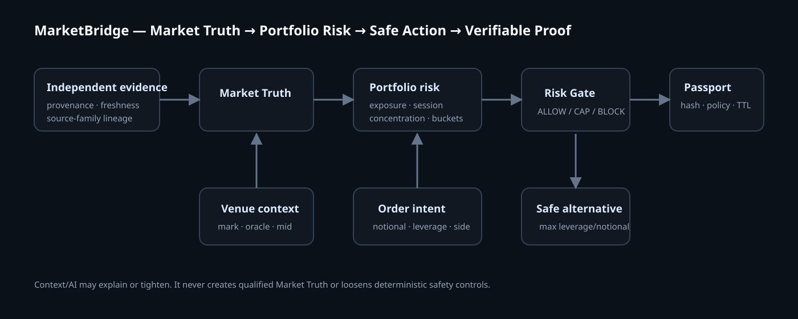

<div align="center">

# 🌉 MarketBridge v1

### Market Truth → Portfolio Risk → Safe Action → Verifiable Proof

**US stocks sleep. Equity perpetuals don’t.**

**Verify the market before leverage acts on it.**

[Live Demo](https://marketbridge-production-d284.up.railway.app/) · [Health](https://marketbridge-production-d284.up.railway.app/health) · [Proof + War Room](https://marketbridge-production-d284.up.railway.app/demo/) · [Historical proof](./docs/PROOF.md) · [Architecture](./docs/ARCHITECTURE.md) · [Threat model](./docs/THREAT_MODEL.md) · [Mochatrade integration](./docs/MOCHATRADE_INTEGRATION.md)

</div>



---

## What MarketBridge does

A 24/7 equity perpetual can keep trading when the underlying US stock has thin, stale, closed-session, or conflicting price discovery. MarketBridge sits beside the venue and asks a simple question before new leverage is allowed:

> **Does this market price deserve enough trust for this order?**

The safety path is intentionally small:

```text
free/live market evidence ──┐
                            ├──> Market Truth ──┐
venue mark / perp context ──┘                   │
                                                ├──> Order Risk Gate
account exposure + order intent ────────────────┘          │
                                                           ├── ALLOW
                                                           ├── CAP_LEVERAGE
                                                           ├── REVIEW
                                                           └── BLOCK_NEW_RISK
                                                                    │
                                                                    ▼
                                                             Safety Passport
                                                                    │
                                                                    ▼
                                                             deterministic replay
```

Valid `REDUCE` and `CLOSE` requests remain available when evidence degrades. `OPEN` and `INCREASE` fail closed when Market Truth is not sufficiently qualified.

## Proof before the synthetic attack

The `/demo/` judge flow now starts with evidence before the controlled War Room:

1. **Historical reconstruction** — published July 2026 SK Hynix / TradeXYZ observations pass through the same deterministic consequence function used by the live risk gate. It is explicitly counterfactual and consumes no future outcome.
2. **Operating benchmark** — a labeled 450-case safety suite reports TP/TN/FP/FN, false-positive and false-negative rates, precision/recall, and measured core/gateway p50/p95/p99 latency.
3. **Portfolio Risk Firewall** — even qualified Market Truth can be capped when the proposed order creates excessive single-name, sector, correlated-risk-bucket, account, or session risk.
4. **Safe Alternative** — capped requests return the maximum permitted leverage and notional instead of a binary no.
5. **Host integration proof** — a reference Mochatrade pre-trade adapter shows how a host binds the short-lived Safety Passport to the exact order.

Proof endpoints:

```text
GET /v1/proof/historical
GET /v1/proof/benchmark
GET /v1/proof/portfolio
```

The historical view is `HISTORICAL_RECONSTRUCTION`, not a licensed consolidated feed. The operating suite is `SYNTHETIC_LABELED_BENCHMARK`, not a historical-market backtest. Latency values are measured when the endpoint runs rather than hard-coded into this README.

See [proof methodology](./docs/PROOF.md), [threat model](./docs/THREAT_MODEL.md), [Mochatrade integration](./docs/MOCHATRADE_INTEGRATION.md), and the [90-second demo recording script](./docs/DEMO_VIDEO_SCRIPT.md).

---
## The hackathon demo

Open `/demo/` and run the judge flow:

1. **Normal market** — independent synthetic witnesses agree and a 10× NVDA open is allowed.
2. **Poison venue mark** — the venue jumps roughly 300 bps away from Market Truth; new risk is blocked.
3. **Prove exit stays open** — the same degraded market still allows a valid close.
4. **Safety Passport** — inspect the decision fingerprint, policy, evidence count and expiry.
5. **Replay without gate** — compare the actual safety decision with a clearly-labelled no-gate counterfactual and show `prevented_additional_exposure_usd`.
6. **Recover safely** — repeated stable evidence moves through `RECOVERY_PENDING` instead of enabling leverage after one good tick.

All attack values are labelled `SYNTHETIC_DEMO`. No trade is submitted and no fake fill/savings claim is made.

## Free-first provider mesh

MarketBridge v1 is provider-agnostic and does not require a paid institutional feed for the public hackathon demo.

| Capability | Provider | v1 role |
|---|---|---|
| Live US equity display/evidence | **Alpaca Basic / IEX** | Free-first underlying-equity stream; IEX remains one witness |
| Perp / venue state | **Hyperliquid** | Venue mark, oracle, mid, funding/OI context; never fed back into independent Market Truth |
| Financial news | **Marketaux** | Cached ticker-linked context only |
| Official company events/facts | **SEC EDGAR** | Primary-source filings and XBRL context; no API key |
| Symbol/reference metadata | **Nasdaq Symbol Directory** | Security master |
| Optional equity cross-check | **Twelve Data** | Optional/internal only unless the actual account entitlement permits the intended use |
| Research fallback | **Yahoo/yfinance** | Legacy research-only, disabled by default, never risk eligible |
| Optional macro context | **FRED** | Context only |
| Optional crypto overview | **CoinGecko Demo** | Display/context only |

**Databento is not part of the v1 free-first product/deployment path.** The paid dependency, environment requirement and import workflow are removed from this branch.

Every provider exposed by `/v1/providers` declares its capability, cost mode, source class, Market Truth authority, configuration status and risk eligibility.

## Three planes, one boundary

### 1. Market evidence plane

Used to reason about the underlying market. Provenance, event time, receipt time, provider family, venue family, freshness and eligibility remain explicit.

### 2. Venue plane

Hyperliquid/Mochatrade context tells MarketBridge what the trading venue currently believes. It is compared **against** independent Market Truth; it is never allowed to manufacture that truth.

### 3. Intelligence context plane

Marketaux news, SEC filings/fundamentals, FRED and optional research sources help explain events. They return `affects_market_truth=false` and cannot loosen deterministic safety controls.

## New judge-facing routes

| Route | Purpose |
|---|---|
| `/` | v1 product thesis and first-view demo CTA |
| `/demo/` | Market Truth War Room: attack → block → exit → passport → replay → recovery |
| `/providers/` | Free-first capability/provider mesh and trust boundaries |
| `/intelligence/` | Marketaux news + official SEC context, visibly separated from Market Truth |
| `/markets/` | Existing live market monitor |
| `/terminal/` | Existing deeper market/risk workstation |

## API additions

```text
GET  /v1/providers
GET  /v1/intelligence/{symbol}
GET  /v1/proof/historical
GET  /v1/proof/benchmark
GET  /v1/proof/portfolio
POST /v1/demo/war-room
POST /v1/demo/war-room/replay
POST /v1/demo/war-room/reset
```

The mature safety APIs remain intact:

```text
POST /v1/integrations/mochatrade/risk-check
GET  /v1/passports/{passport_id}
POST /v1/replay/risk-decision
POST /v1/passports/{passport_id}/outcome
```

## Run locally

Requirements: Python 3.12+, Node 24+, `uv`, npm.

```bash
cp .env.example .env
make setup
make demo
```

Open:

```text
http://127.0.0.1:8000/
http://127.0.0.1:8000/demo/
```

The public synthetic War Room needs no market-data key. To enable real free-first market display, add Alpaca credentials to the backend `.env`. Provider credentials must never be exposed through `NEXT_PUBLIC_*` variables.

## Verify

```bash
make verify
make benchmark-risk
make e2e
make live-check
```

CI checks Python lint/tests, TypeScript, frontend unit tests/build, browser flows, synthetic evaluation and deterministic replay.

## Safety / honesty boundary

MarketBridge is a hackathon/pilot advisory architecture, **not** a certified exchange oracle, broker, custody system or liquidation authority.

- No exchange signing key, wallet key or custody key is held.
- No live trade is submitted by the demo.
- AI may tighten but never loosen deterministic controls.
- Learned estimates never become trusted anchors on their own.
- One provider is never presented as independent consensus.
- Multiple vendor labels sharing one upstream are not counted as independent witnesses.
- News, filings, macro and research data do not create Market Truth.
- Unknown entitlement/display rights are treated conservatively.
- Counterfactual replay reports prevented **simulated additional exposure**, not guaranteed savings.

## Team and license

**Team FinalCommit:** Harshil Amin · Aniket Gaikwad. Implementation provenance remains visible in Git history; [TEAM.md](./TEAM.md) intentionally avoids inventing role attribution.

Licensed under MIT. See [LICENSE](./LICENSE).

## Deployment economics

The deterministic risk-critical policy path uses **0 LLM calls** and **0 paid API calls inside the policy function**. Hosting and market-data licensing remain deployment/entitlement specific; MarketBridge does not invent a dollar cost without measured inputs.

## Why this is different

Trading AI asks: **Where will price go?**

Fraud systems ask: **Can we trust this user or transaction?**

Traditional margin systems ask: **How much leverage can this account survive?**

MarketBridge asks upstream:

> **Can we trust this market enough for this portfolio to take this leverage — and can we prove why we allowed or denied it?**

That is the product.